# THE POD HOUSE

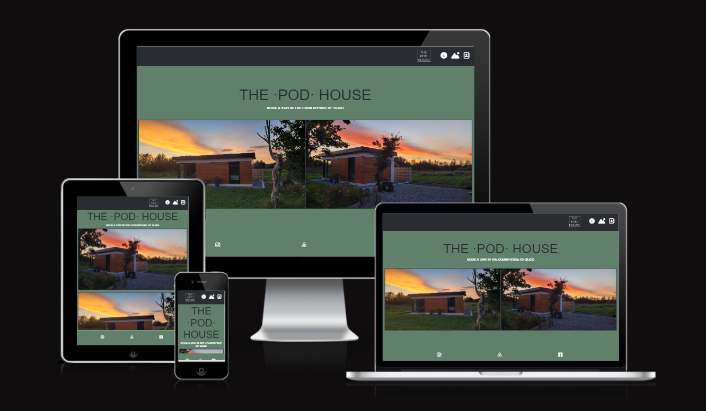

THE POD HOUSE is a web page designed to advertise our tiny-house property as short-term holiday rental for tourists who want to explore Sligo North area. The page provides users with relevant information, as well as the option to make a booking for their desired dates of visiting.

## User Experience (UX)
## User Stories

* As user visiting the website I want to be able to find relevant information regarding the looks and features of the property.
* As user visiting website I want to navigate easily through the website.
* As user I want to see landing page and navigate through it.
* As a user I want to learn about what is included when I book a stay, as well as the various activities around the area.
* As user I want to fill in details in a Booking form to succesfully book a short term stay.
* As user I want to fully understand what all is included when I am making a booking.
* As user I want you be able to use map in the LOCATION section.
* As user I want to see a confirmation page after booking a stay.

# Website Goals
* Increase bookings for the property.
* Use the website tool to expand and grow as a business.
* Easy access on all kinds of devices..
* Clear information about the property and services rendered.
* Easily navigated and understood.
* Simple ways to book a short-term stay in the tiny-house.
* Simple ways to find the property on map.
* Landing page to be nice and sleek.
* Easily readable for everyone.
* Form to work correctly.

### Design
#### Colors:

* Colors used on the website are:

* Olive-green #60806c

* Dark-grey #292c31

* White #ffffff;

#### Fonts:

Fonts used on website are Bebas Neue, Oswald and Inter from google fonts. 
Backup fonts is sans-serif if main font cannot be loaded for any reason.

#### Images:

Various images have been used to showcase the property. These images, of both the exterior and interior, were taken personally and shows the user what the property looks like and what they can expect when they choose to make a booking.

Website structure

| Screen size | Breakpoint |
|---|---|
|small   |>= 280px (mobile-first design)|
|medium	 |>= 576px|
|large	 |>= 830px|
|extra large   |>= 1000px|

Back to top

## Technology, Frameworks and Programs used.
### Languages

* HTML

* CSS

#### Frameworks and Programs used.

Google fonts was used to pick and import fonts to my project.

* GitHub

GitHub was used to store my source code by git add . git commit and git push.

* Git

Git was used with GitPod to write down the code and push it to GitHub.

* Screenfly

Testing website.
Features
Responsive on all devices.
Interactive buttons

* Fontawesome

Fontawesome was used to obtain various icons used within the website, such as within the the INCLUDING section as well as THINGS TO DO section of the page.

* Am I Responsive

To test various screen-size responsiveness.

# SECTIONS OF WEBSITE

1. Navigation Bar
2. Home/Landing Page section
3. THE POD images and features section
4. THINGS TO DO section
5. BOOKING FORM section
6. LOCATION/ADDRESS section
7. Footer

## Navigation bar

 - Navigation bar will be mostly the same through out the website, placed on a sticky header at the top, with navigation icons anchored to relevant sections of the page.

    - For mobile devices, Tablets and PC screen sizes, the navigation bar will look the same and keep the same size.

    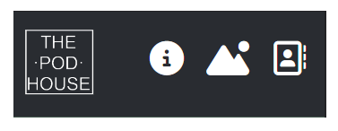

    - ERROR 1 ON TABLET AND PC DEVICES:

     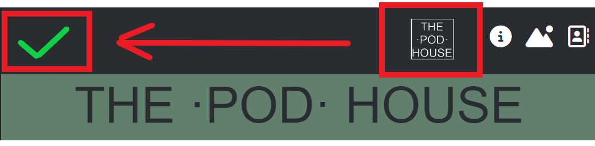

        PLEASE NOTE: ERROR has occured where "THE POD HOUSE" logo does not stick to the left as the dimensions become bigger at tablet and pc display.

    - ERROR 2 ON ALL DEVICES

    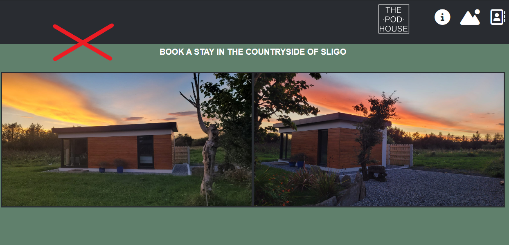

        PLEASE NOTE: ERROR has occured where the sticky-nav bar falls over the intended anchored element, causing the  anchored H1 elements not too display at the top

    - How it should be: 

    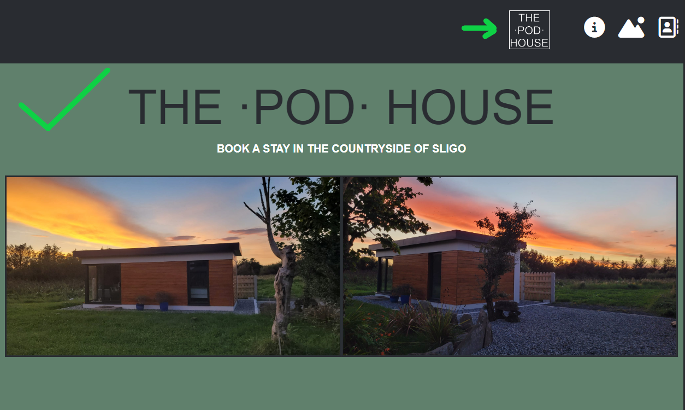    

## Landing Page

* Landing page should show the main header and include some/all (depending on device) of the 2 hero images. This is followed by 2 paragraphs of descriptive text.

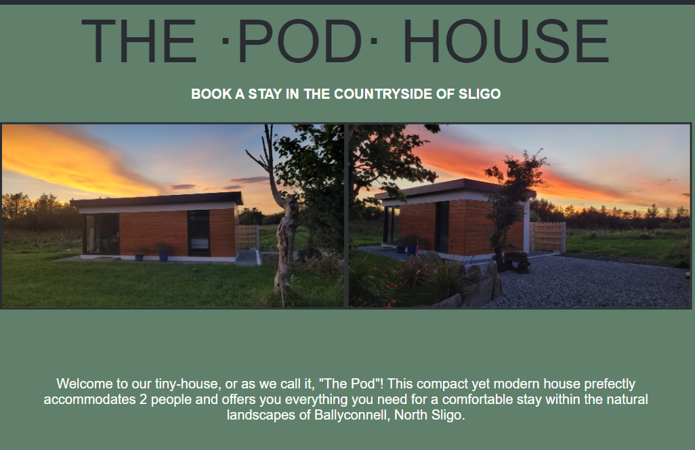

## THE POD Images/features section

-The FEATURES section starts with THE POD header followed by two sub-sections IMAGES and FEATURES, which include 5 images of the tiny-house's interior, followed by a list of features the guests can expect when booking the tiny-house.

### IMAGES SUB-SECTION

* First Image (KITCHEN & LIVING ROOM) is horizontal and acts as mini-hero image for this section. The following images all displays vertically afterwards.

#### FOR MOBILE (280px-576px)
* All images flows top-down starting with 'Kitchen & Living Room' image, ending with 'Shower & Sink'

#### FOR TABLET (576px-830px)
* Mini-hero image stays at the top and the other 4 images are then wrapped to show in rows of 2 each.

#### FOR FULL SCREEN (830px-1000px)

* All images are flexed in a row order stretching from left to right

MOBILE | TABLET | FULL SCREEN 
 :---:|:---:|:---:
 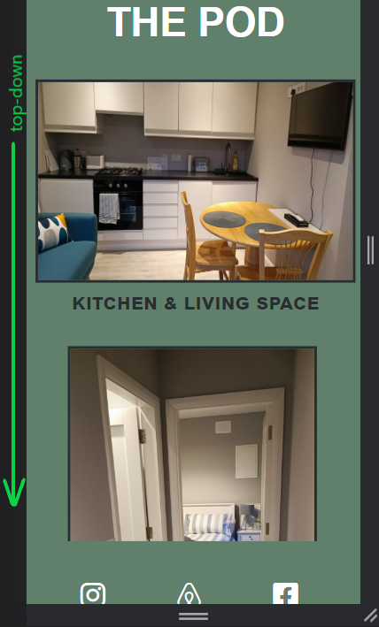 | 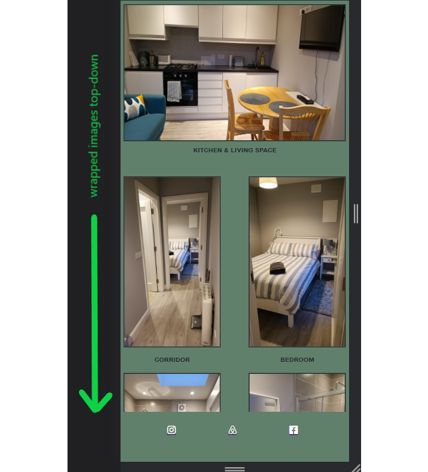 | 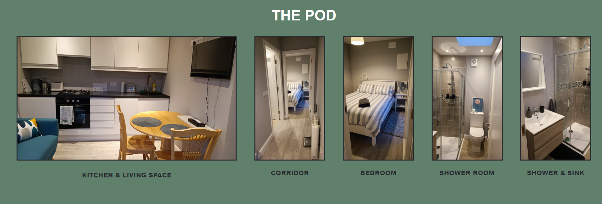

### FEATURES LIST SUB-SECTION

* The FEATURES LIST is the second part of THE POD section. The list includes 6 features, each containing an icon abtained at Fontawesome.

 MOBILE | TABLET | FULL SCREEN 
 :---:|:---:|:---:
 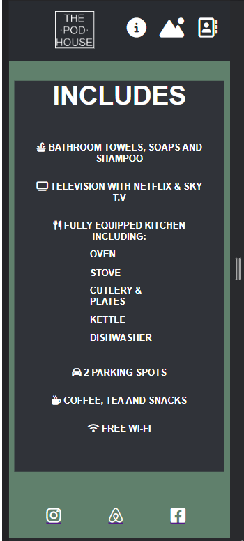 | 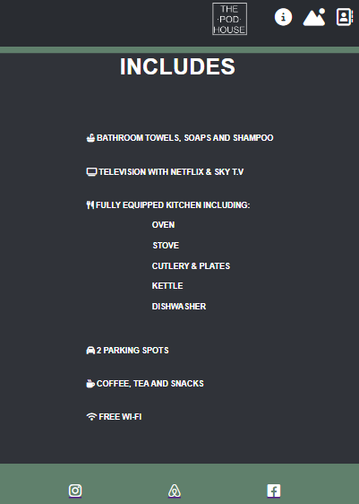 | 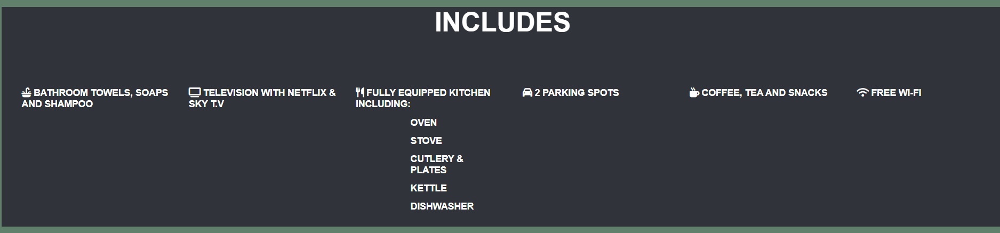

## 'THINGS TO DO' SECTION

This section includes 6 images of various activities and things to do within the nearby area of the tiny-house. This provides information to the user of what they can look forward to doing around the nearby area.

* PLEASE NOTE: These images were sourced from FONTAWESOME and converted to .jpegs due to needing some of the icons' background colour within the icon in order to match the background of the webpgae. I did that by editing the downloaded icon and changing it in MS Paint, and then uploading those .jpegs to the 'assets' folder.

* All images were captioned directly uderneath the image.

MOBILE | TABLET | FULL SCREEN 
 :---:|:---:|:---:
 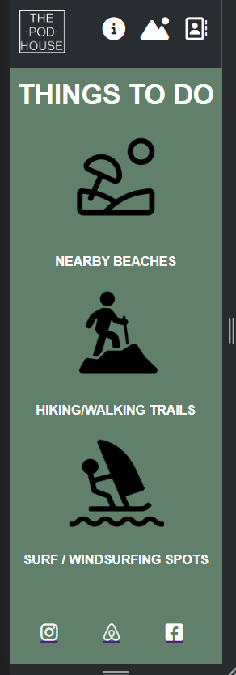 | 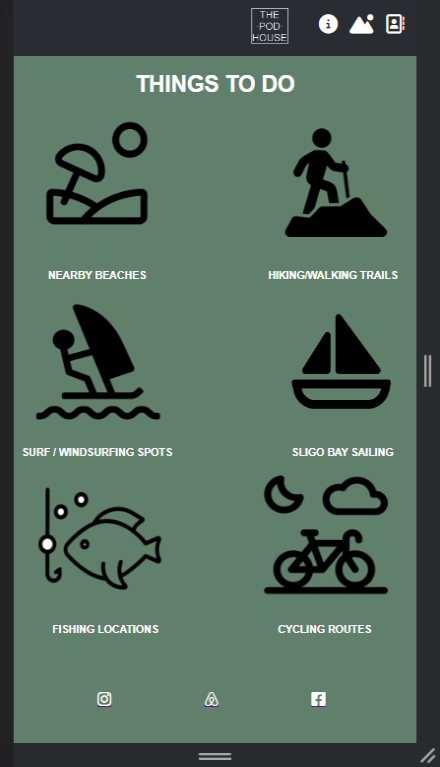 | 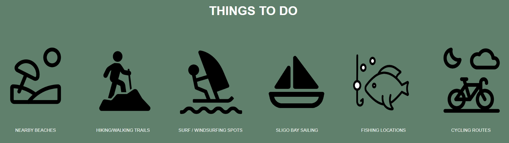

